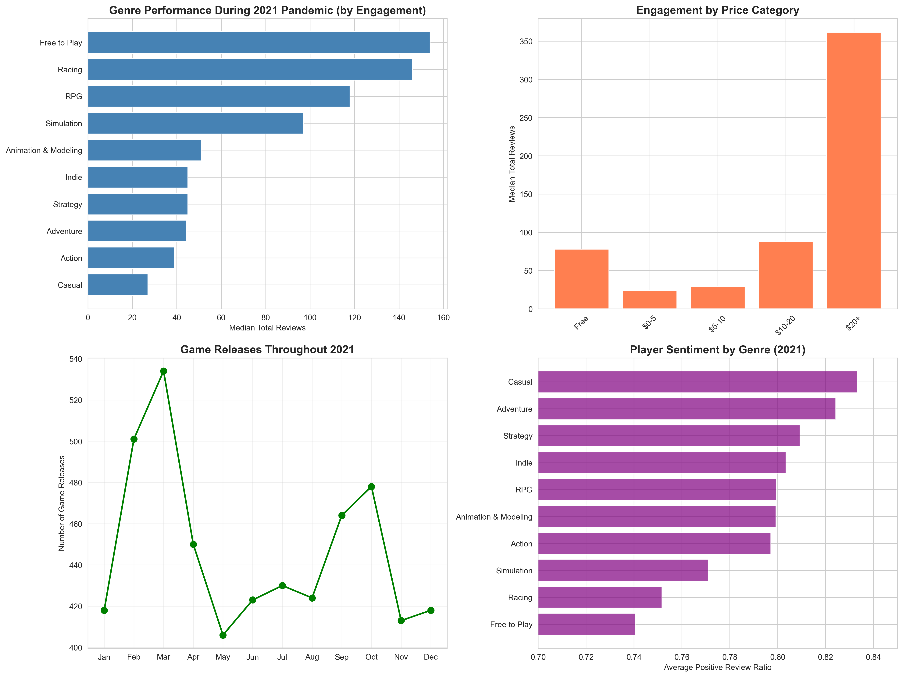
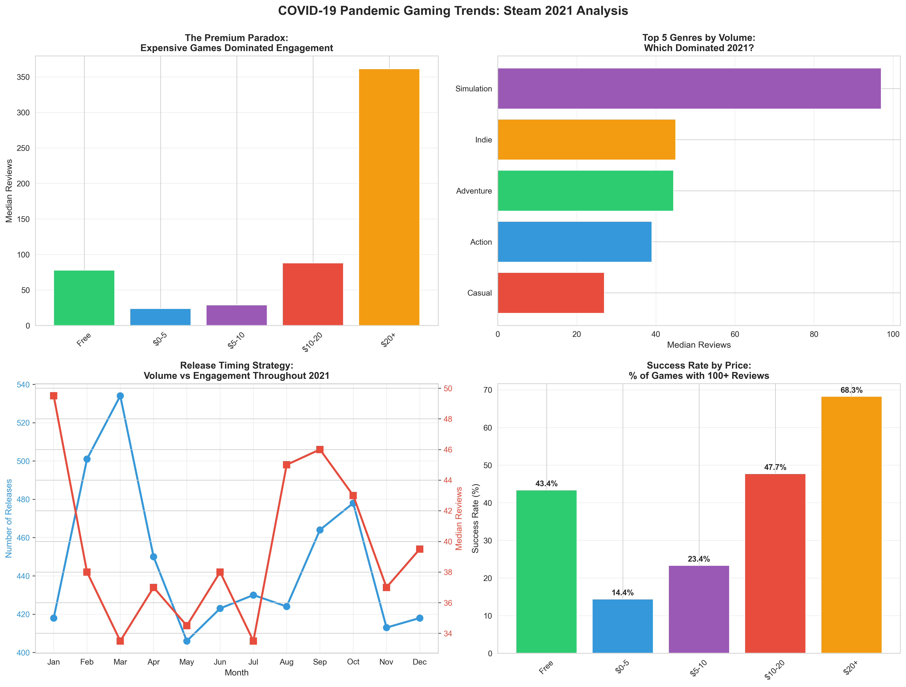

# ML/AI Engineer Foundations: Final Portfolio Project

## COVID-19 Pandemic Steam Gaming Analysis (2021)

### Project Overview
An analysis of Steam gaming trends during the peak of the COVID-19 pandemic (2021), exploring how lockdowns and stay-at-home orders influenced game success patterns. This project examines the relationship between game characteristics (genre, price, release timing) and success metrics (ratings, player counts, reviews) during an unprecedented period of global gaming engagement.

### Key Findings

#### 📊 Dataset Overview
- **Total games analyzed:** 5,359 games with meaningful engagement (10+ reviews)
- **Highly successful games:** 1,705 games (31.8%) achieved 100+ reviews
- **Data quality:** Comprehensive feature set including pricing, genres, playtime, and user sentiment

#### 🎮 Genre Insights
- **Action games dominated** the market with 40.8% of all releases
- **Top performing genres by engagement:**
  - Free to Play: 154 median reviews
  - Racing: 146 median reviews  
  - RPG: 118 median reviews
- Despite high volume, Action and Casual games showed lower individual engagement, suggesting market saturation

#### 💰 The Premium Paradox
One of the most surprising findings: **expensive games significantly outperformed cheaper alternatives during the pandemic**
- Premium games ($20+) success rate: **68.3%**
- Free games success rate: **43.4%**
- Median price of successful games: **$14.99**
- **Insight:** Players invested in quality experiences during lockdown, prioritizing depth over price

#### 📅 Timing Strategy
- **Best months to release:**
  - January: 50 median reviews
  - September: 46 median reviews
  - August: 45 median reviews
- Early year releases showed better engagement, possibly due to less competition and New Year gaming enthusiasm

#### 🏆 Player Behavior During Pandemic
- Average positive sentiment for successful games: **83.1%**
- Multiplayer/social games saw massive concurrent user spikes (up to 74,621 peak CCU)
- High review ratios indicate satisfied, engaged communities
- Players prioritized long-form, immersive experiences over casual gaming

### Top 10 Games of 2021
1. **Valheim** - $19.99 - 353,418 reviews (95.4% positive)
2. **New World** - $39.99 - 228,814 reviews (67.7% positive)
3. **Tale of Immortal** - $19.99 - 209,045 reviews (50.4% positive)
4. **Battlefield 2042** - $29.99 - 145,159 reviews (27.0% positive)
5. **Halo Infinite** - Free - 144,296 reviews (73.6% positive)

### Recommendations for Indie Developers
1. **Don't compete on price** - Quality matters more during high-engagement periods
2. **Target proven audiences** - Action, Adventure, and Casual genres have established player bases
3. **Time your launch strategically** - Early year releases (Jan-Feb) showed better engagement
4. **Focus on retention** - Playtime and community building drive long-term success
5. **Invest in multiplayer features** - Games with high concurrent users had better retention

### Dataset
**Source:** [Kaggle - Steam Games Dataset](https://www.kaggle.com/datasets/fronkongames/steam-games-dataset?resource=download)  
**Scope:** 2021 data (peak pandemic period)  
**Size:** 12,309 total games, 5,359 with meaningful engagement  
**Key Features:** Genre, Price, Release Date, User Ratings, Peak CCU, Player Counts, Reviews

### Technologies Used
- **Python 3.x** - Primary programming language
- **Pandas** - Data manipulation and analysis
- **NumPy** - Numerical computing
- **Matplotlib/Seaborn** - Data visualization
- **Jupyter Notebook** - Interactive analysis environment

### Project Files
```
├── README.md
├── steam_2021_pandemic_analysis.csv          # Cleaned dataset
├── key_findings_summary.csv                   # Executive summary
├── top_20_games_2021.csv                      # Top performing games
├── overview_analysis.png                      # Main visualization
├── pandemic_story.png                         # Pandemic insights viz
└── analysis_notebook.ipynb                    # Full analysis notebook
```

### Visualizations


*Genre performance, pricing strategy, release timing, and player sentiment analysis*


*The premium paradox, genre dominance, timing patterns, and success rates*

### Methodology

1. **Data Preparation**
   - Extracted 2021 data from comprehensive Steam dataset
   - Cleaned and preprocessed 12,309 games
   - Filtered to 5,359 games with meaningful engagement (10+ reviews)

2. **Feature Engineering**
   - Parsed release dates and extracted temporal features
   - Created price categories for comparative analysis
   - Calculated success metrics (total reviews, review ratios)
   - Extracted primary genres from multi-genre tags

3. **Analysis Approach**
   - Exploratory data analysis to identify patterns
   - Genre performance comparison across success metrics
   - Pricing strategy analysis with success rate calculations
   - Temporal analysis of release timing throughout 2021
   - Visualization of key findings and insights

### Key Insights

**The COVID-19 pandemic created a unique gaming market characterized by:**
- High player engagement and willingness to invest in premium experiences
- Strong preference for immersive, long-form content over casual gaming
- Robust multiplayer communities seeking social connection during lockdown
- Quality-over-price purchasing decisions from players with more time at home

This analysis provides actionable insights for game developers looking to understand player behavior during high-engagement periods and optimal strategies for game releases in similar market conditions.

### How to Run

1. **Install dependencies:**
```bash
pip install pandas numpy matplotlib seaborn jupyter
```

2. **Launch Jupyter Notebook:**
```bash
jupyter notebook
```

3. **Open and run the analysis notebook:**
- Navigate to `analysis_notebook.ipynb`
- Run all cells to reproduce the analysis

### Future Work
- Compare 2021 trends with pre-pandemic years (2019-2020)
- Analyze 2022-2023 post-pandemic gaming trends
- Deep dive into specific genre subcategories
- Incorporate player demographics and geographic data
- Predictive modeling for game success factors

---

**Author:** Ed Marcus Daniel R. Arguelles  
**Date:** October 2025  
**Course:** Data and Programming Foundations for AI - Codecademy
