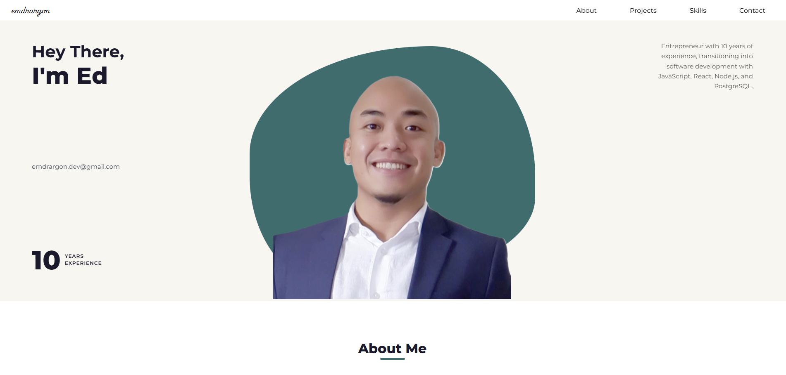

# Portfolio Website

  

A personal portfolio website showcasing my transition from entrepreneurship into software development.

Built to highlight my projects, technical skills, and professional background, while demonstrating front-end development fundamentals and real-world functionality.

---

## 🚀 Live Features

* Responsive portfolio layout
* Animated sections using AOS (Animate On Scroll)
* Interactive project cards (flip on click)
* Infinite scrolling skills carousel
* Functional contact form powered by EmailJS
* Smooth scroll and scroll-to-top button

---

## 🛠️ Tech Stack

* HTML5
* CSS3
* JavaScript (Vanilla)
* EmailJS (for contact form integration)
* AOS (Animate On Scroll library)
* Font Awesome

---

## 📂 Project Structure

assets/
│
├── css/
│   └── style.css
│
├── js/
│   └── main.js
│
└── images/
└── (profile + assets)

index.html

---

## 📌 Key Highlights

### 1. Interactive UI Components

* Project cards flip on click using JavaScript
* Smooth hover effects and transitions across sections

### 2. Contact Form Integration

* Fully functional email form using EmailJS
* Handles async requests with loading state and success/error feedback

### 3. Performance & UX

* Lightweight (no frameworks)
* Clean layout and readable structure
* Scroll-based animations for better user experience

---

## ⚙️ Setup & Usage

1. Clone the repository:

git clone https://github.com/emdrarguelles/Portfolio.git

2. Open index.html in your browser

---

## 📧 EmailJS Setup (Required for Contact Form)

To enable the contact form:

1. Create an account at https://www.emailjs.com/

2. Create:

   * Email Service
   * Email Template

3. Replace the following in main.js:

emailjs.init('YOUR_PUBLIC_KEY');

emailjs.sendForm('YOUR_SERVICE_ID', 'YOUR_TEMPLATE_ID', form);

4. Ensure template variables match:

{{from_name}}
{{from_email}}
{{subject}}
{{message}}

---

## 📈 Future Improvements

* Add backend (Node.js / Express) for custom form handling
* Convert to React for component-based architecture
* Add project detail pages
* Improve accessibility (ARIA, semantic enhancements)

---

## 👤 Author

Ed Arguelles

* GitHub: https://github.com/emdrarguelles
* LinkedIn: https://www.linkedin.com/in/edmarcusarguelles/
